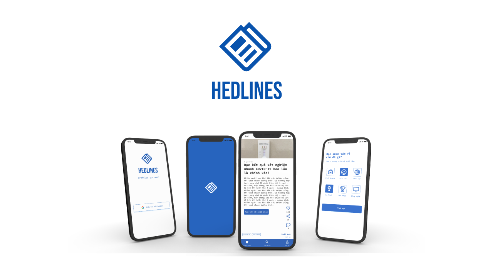

# Hedlines


An mobile app that allows users to view lastest news from many trusted-sources.

## Features

- Login
- Update preferences
- View articles (news) by vertical sliding (like Tiktok)

## Promotion Video

[![INTRO VIDEO]](https://www.youtube.com/watch?v=1e7YgQerrK8)

## Tech Stack

**Client:** Flutter (Dart)

**Server:** Firebase, Flask (Python), Google Cloud Platform (GCP)

**State Management:** GetX

## Installation

Get the **APK** in release page

*OR*

Step 1:

Download or clone this repo by using the link below:

```terminal
git clone https://github.com/princ3od/Hedlines.git
```

Step 2:

Go to project root and execute the following command in console to get the required dependencies and start:

```terminal
flutter pub get
flutter run
```

Now, lets dive into the lib folder which has the main code for the application.

```terminal
1- controller - All controller in project
2- configs - Contains the config for application, such as: theme, languages,...
3- constants - All the application level constants are defined in this directory with-in their respective files.
4- data - Contains the data layer of your project, includes directories for local, network and shared pref/cache.
5- helpers - Contains the utilities/common functions of your application.
6- models - Define model using in application, support parse raw data to object
7- routes - Define route name and map screen with route
8- services - Contains all services using in application, such as: socket, firebase messaging, in app review, webrtc, etc..
9- ui - Contains all the ui of your project, contains sub directory for each screen.
```

## Authors

- [Dương Bình Trọng](https://www.github.com/princ3od)
- [Phạm Đức Hoàng](https://github.com/PRID021)
- [Trần Đặng Hoàng Anh](https://github.com/TranDangHoangAnh)

## Screenshots

<p align="center">
 
 
 
<br/>
<br/>
 
</p>
